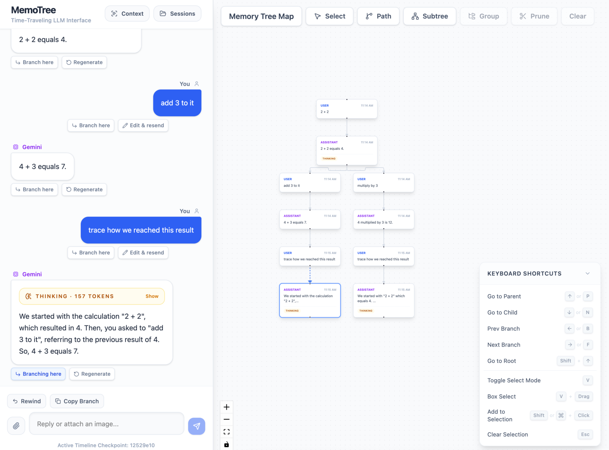
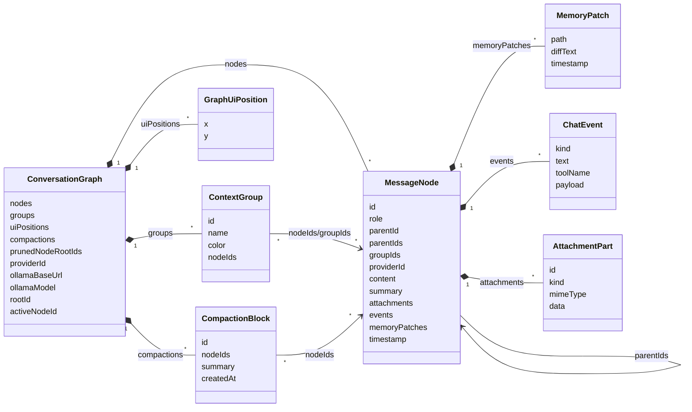

# MemoTree

MemoTree is a local-first branching chat interface for LLM conversations. Instead of treating a conversation as one linear transcript, MemoTree keeps alternate paths visible as a tree, reconstructs only the active branch for the next model request, and keeps branch-local memory separate.



## Quick Start

MemoTree is a frontend-only Vite app. There is no backend service to start, no database to provision, and no hosted account required. Sessions are stored in your browser's IndexedDB.

```bash
npm install
npm run dev
```

Open the local Vite URL, choose a provider, and start a session:

```text
http://localhost:5173/
```

For Gemini, paste your API key in the local browser UI. For Ollama, keep Ollama running locally and switch the provider to Ollama. MemoTree will try to detect installed local models in the background and select one; if detection fails, type a model from `ollama list` or pull one first. The `Refresh list` button is optional and updates the local model selector. Image input is enabled automatically for Ollama models that report the `vision` capability.

```bash
ollama serve
ollama pull gemma3
```

You can also create a local `.env` from `.env.example`, but do not use `VITE_GEMINI_API_KEY` for a public/static deployment because Vite embeds client env vars into the built JavaScript bundle.

If the browser cannot reach Ollama because of CORS, start Ollama with the Vite origin allowed. Replace `5173` if Vite prints a different port.

```bash
OLLAMA_ORIGINS=http://localhost:5173,http://127.0.0.1:5173 ollama serve
```

## Why MemoTree

Linear chat makes it hard to explore alternatives without dragging failed attempts, tangents, and stale assumptions into later prompts. MemoTree treats conversation history as a tree:

- reply from any earlier message to fork a new branch
- click a graph node to check out that exact path
- inspect what context and memory the model will receive
- prune or group branches when the map gets busy
- export or import local session JSON

The product claim is context control, not magic hallucination prevention: MemoTree helps you see and manage what the model saw, so stale context from one branch does not silently leak into another.

## Inspiration

MemoTree is inspired in part by Toby Cubitt's Emacs [`undo-tree`](https://elpa.gnu.org/packages/undo-tree.html) package, which makes editing history explicit as a branching tree instead of treating undo and redo as a single linear stack. MemoTree applies that interaction idea to LLM conversations: alternate directions, failed attempts, and exploratory branches stay navigable instead of collapsing into one prompt history.

## Current Features

- branching chat and graph navigation
- local session persistence with IndexedDB
- local JSON session import/export
- pasted transcript import
- Markdown rendering
- image attachment input for Gemini and Ollama vision models
- branch-local memory state
- context inspector
- node selection, grouping, and reversible branch pruning

Gemini and Ollama are the currently wired model providers. Model requests happen directly from your browser to either Gemini using your own API key or a local Ollama server.

## Data Model

At rest, a MemoTree session is a `ConversationGraph`: a map of message nodes, the root and active checkpoint, visual organization metadata, and optional context metadata. The conversation path is the core data model, but supporting state is stored beside it so the tree remains navigable across reloads.

The default conversation path behaves like a tree because each `MessageNode` has a primary `parentId`; the schema is DAG-capable because nodes can also store `parentIds` for merge-style workflows.



For a model request, MemoTree resolves `activeNodeId`, walks the primary `parentId` chain back to `rootId`, reverses that path, and sends only those nodes as prompt history. Branches that are not on the active path remain in the graph but are not included in that request.

Memory is also branch-local. MemoTree starts from an empty memory object and replays only the `memoryPatches` attached to nodes on the active path, rather than using one global memory buffer for all branches.

Visual metadata does not decide what the model sees. Groups, saved node positions, summaries, and pruned branch roots help users organize the map, while prompt construction still follows the active conversation path. Compaction blocks, when enabled, summarize selected path ranges without changing the graph lineage.

Provider metadata is local configuration. Persisted sessions can remember the selected provider and Ollama base URL/model so local sessions reopen cleanly, but Gemini API keys are excluded from saved and exported session JSON.

## Development

- `npm run dev` starts the local frontend.
- `npm run build` runs TypeScript checks and builds `dist/`.
- `npm run lint` runs ESLint.
- `npm run preview` serves the production build locally.

Advanced experiments are disabled by default and controlled through `src/config/featureFlags.ts`.

Shared-link fetching and server-backed import are intentionally excluded from this frontend-only distribution. Importing a pasted visible transcript is supported locally.

## Privacy Notes

- Do not commit API keys.
- Browser-entered keys are kept in app state for the local session, not written into exported session JSON.
- Ollama base URL and model name may be stored with local sessions, but they are connection settings, not secrets.
- Conversation data and memory patches are stored locally in IndexedDB unless you export them.
- Static hosting a bring-your-own-key frontend means model requests happen from the user's browser.

## License

MIT
